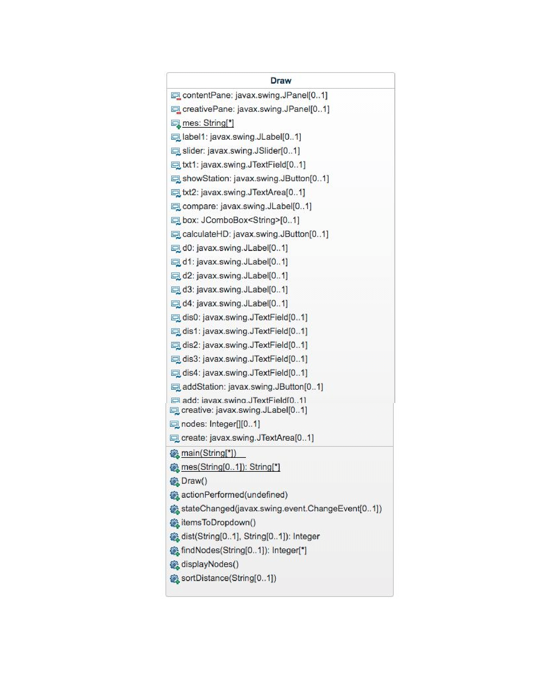

# Project5

For this project, I had to create a GUI java program to calculate hamming distance,
show which stations had a certain hamming distance from a specified station, and 
add available stations to the list.

In order to achieve these goals, all the gui components were declared as universal variables.
Two panels were created, contentPane and creativePane.
Additionally, an ArrayList, mes, was created to hold all the mesonet stations.

In the main method, the frame is created and the method to read the stations into the arrayList
is called. 

In the mes method, the return type is a String ArrayList, and all the stations from Mesonet.txt
are read into the arraylist.

In the draw method, all of the universal gui variables are given their respective places on the gridBagLayout,
and added to the contentPane. The creativePane's elements, JLabel create and JTextArea creative are added to it.
creativePane is added to contentPane.
The following variables are added to contentPane and are universal:
  	
	JLabel label1
	
	JSlider slider
	
	JTextField txt1
	
	JButton showStation
	
	JTextArea txt2
	
	JLabel compare
	
	JComboBox<String> box
	
	JButton calculateHD
	
	JLabel d0
	
	JLabel d1
	
	JLabel d2
	
	JLabel d3
	
	JLabel d4
	
	JTextField dis0
	
	JTextField dis1
	
	JTextField dis2
	
	JTextField dis3
	
	JTextField dis4
	
	JButton addStation
	
	JTextField add
	
	JLabel creative
	
	JTextArea create
  
The actionPerformed method handles all button clicks. For the ShowStation button,
all stations matching the number specified on the slider are displayed in txt2.
For the calculateHD button, all distances are calculated and displayed in dis0, 1, 2, & 3.
For the addStation button, the typed station is added to the JComboBox.

The stateChanged method handles any changes to the slider. Any change made to the slider is
reflected in the JLabel txt1.

The itemsToDropdown method takes each item in the mes arrayList and puts it into the JComboBox.

The dist method takes in two strings and finds the hamming distance between the two of them.

The findNodes method takes in a string and finds the number of other stations with 0, 1, 2, 3, and 4
as their hamming distance. This is returned as an array of integers. 

The displayNodes method takes the array of distances and displays them in the dis0, dis1, dis2, dis3,
and dis4 JTextFields.

The sortDistance method finds stations that have the hamming distance specified by the slider with the
chosen station from the JComboBox. It then displays them into txt2.

The uml is displayed below.

